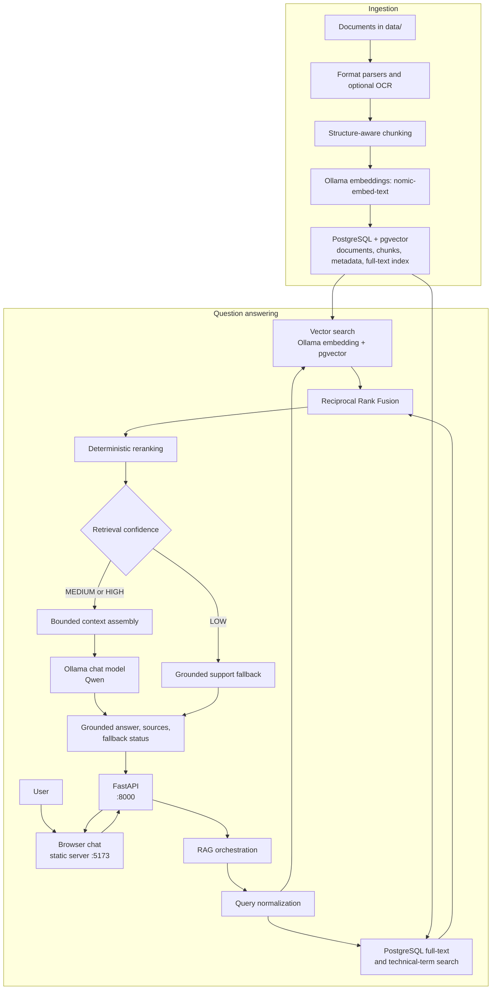

# RAG AI Chatbot

[](https://www.python.org/)
[](https://fastapi.tiangolo.com/)
[](https://www.postgresql.org/)
[](https://docs.docker.com/compose/)
[](https://ollama.com/)

## About the Project

RAG AI Chatbot answers questions using documents placed in the local `data/` directory. It extracts and chunks document text, stores Ollama-generated embeddings and metadata in PostgreSQL with pgvector, and retrieves relevant passages using both vector similarity and PostgreSQL full-text/technical-term search. The results are fused, deterministically reranked, checked for retrieval confidence, and assembled into a bounded context for local Qwen generation. Responses include source paths; low-confidence retrieval returns a support fallback instead of generating from unrelated context.

The repository includes a FastAPI API and a separate browser chat page. Document ingestion is an offline command; the API initializes the database schema at startup.

## Architecture Flowchart



## Tech Stack Table

| Category | Technology | Purpose |
|---|---|---|
| Language | Python 3.12 | API, ingestion, retrieval, and model integration |
| API | FastAPI, Uvicorn | JSON chat, server-sent-event streaming, and HTTP service |
| RAG integration | LangChain | Ollama chat and embedding clients, document and chunk utilities |
| Local inference | Ollama, Qwen (`qwen3.5:4b`), `nomic-embed-text` | Answer generation and 768-dimensional document/query embeddings |
| Database | PostgreSQL 16, pgvector | Document/chunk storage, vector similarity, and full-text search |
| Database service | Docker Compose | Runs the local PostgreSQL/pgvector container |
| Document parsing | pypdf, python-docx, openpyxl, python-pptx, Beautiful Soup | Extract text and structure from supported document formats |
| OCR | Tesseract, pytesseract, Pillow | Optional text extraction from images and scanned PDF content |
| Web chat | HTML, CSS, JavaScript | Browser interface served separately by Python's HTTP server |

## Repository Structure

```text
rag-ai-chatbot/
├── app/
│   ├── ingestion/       # File discovery, parsers, OCR, chunking, storage
│   ├── retrieval/       # Normalization, search, fusion, reranking, context
│   ├── llm/             # Provider interface and Ollama implementation
│   ├── main.py          # FastAPI endpoints and application lifespan
│   ├── rag.py           # Question-answering orchestration
│   ├── database.py      # PostgreSQL/pgvector schema and connections
│   └── config.py        # Environment-based configuration
├── data/                # Local documents; contents are ignored by Git
├── scripts/
│   └── benchmark_latency.py
├── tests/               # Unit tests and parser fixtures
├── web/                 # Static chat interface and local web server
├── .env.example
├── docker-compose.yml
├── requirements.txt
└── README.md
```

## Prerequisites

- Python 3.12.
- Docker Engine/Desktop with the Docker Compose plugin, for the PostgreSQL 16 + pgvector service defined in `docker-compose.yml`.
- Ollama installed and running locally. The default endpoints are `http://localhost:11434`.
- Ollama models `qwen3.5:4b` (chat) and `nomic-embed-text` (embeddings).
- Tesseract OCR is optional. Install it and make its executable available on `PATH` only if you need OCR for images or scanned PDF content.

The API, ingestion command, and chat page run as local Python processes. PostgreSQL is the service provided by Docker Compose; Ollama and Tesseract are installed separately.

## Installation & Configuration

The commands below use PowerShell on Windows. Run them from the repository root.

1. Clone the repository and enter it:

   ```powershell
   git clone https://github.com/premkumarrs/rag-ai-chatbot.git
   Set-Location rag-ai-chatbot
   ```

2. Create and activate a Python environment, then install the project dependencies:

   ```powershell
   python -m venv .venv
   .\.venv\Scripts\Activate.ps1
   python -m pip install -r requirements.txt
   ```

3. Create a local environment file and configure the database password:

   ```powershell
   Copy-Item .env.example .env
   ```

   Set `POSTGRES_PASSWORD` and `DATABASE_URL` in `.env`; use the same local, URL-safe password in both. Set `DATABASE_URL` to a PostgreSQL connection URI for user `raguser` on `localhost:5433`, database `rag_ai_chatbot`. `.env` is ignored by Git. The application reads it without overriding variables already set in the process environment. Update `DATABASE_URL` if you change the database connection, `OLLAMA_HOST` for embeddings, `OLLAMA_BASE_URL` for chat generation, `CHAT_MODEL` or `EMBEDDING_MODEL` to select different installed models, and `SUPPORT_CONTACT` for fallback messages. `LLM_PROVIDER` defaults to `ollama`; the other provider classes are not implemented for generation. Set `LLM_WARMUP=0` to disable startup model warmup.

4. Start PostgreSQL with pgvector:

   ```powershell
   docker compose up -d
   ```

   Compose publishes PostgreSQL on `127.0.0.1:5433` (container port `5432`) and persists its data in the `rag_postgres_data` volume. The local database is `rag_ai_chatbot`; its password comes from the ignored `.env` file. The database initialization command below creates the pgvector extension and application tables; ingestion also initializes the schema automatically.

5. [Install Ollama](https://ollama.com/download) for your operating system, start it, and pull the configured models:

   ```powershell
   ollama pull qwen3.5:4b
   ollama pull nomic-embed-text
   ```

   If Ollama is not already running as a service, start it in a separate terminal with `ollama serve`.

6. Initialize the database schema:

   ```powershell
   python -c "from app.database import init_db; init_db()"
   ```

7. (Optional) Install Tesseract OCR on Windows and verify it is on `PATH`:

   ```powershell
   winget install UB-Mannheim.TesseractOCR
   tesseract --version
   ```

8. Place supported documents directly in `data/` (not in subdirectories), then ingest them:

   ```powershell
   python -m app.ingest
   ```

   Supported extensions are `.pdf`, `.docx`, `.txt`, `.md`, `.markdown`, `.csv`, `.xlsx`, `.pptx`, `.html`, `.htm`, `.json`, `.png`, `.jpg`, `.jpeg`, `.tif`, and `.tiff`. The `data/` contents are ignored by Git; do not add company documents to version control.

## How to Run

Run the following commands from the repository root with the virtual environment activated. Keep PostgreSQL and Ollama running.

Start or check the database service:

```powershell
docker compose up -d
docker compose ps
```

Ingest new or changed documents (the command initializes the schema when needed):

```powershell
python -m app.ingest
```

### API

Start the API in its own terminal:

```powershell
uvicorn app.main:app --host 127.0.0.1 --port 8000
```

The API initializes the database schema during startup and will fail to start if initialization fails. Available endpoints:

| Method | Path | Description |
|---|---|---|
| `GET` | `/health` | Basic service health |
| `POST` | `/chat` | Return a grounded JSON answer |
| `POST` | `/chat/stream` | Stream answer events as server-sent events |

Interactive API documentation is available at <http://127.0.0.1:8000/docs>; the health endpoint is <http://127.0.0.1:8000/health>.

### Web Chat

In another terminal, start the separate static web server:

```powershell
python web/server.py
```

Open <http://127.0.0.1:5173>. The page sends streaming chat requests to the API at `http://127.0.0.1:8000`; both processes must be running.

Run the unit tests:

```powershell
python -m unittest discover -s tests -p "test_*.py" -q
```

Optionally measure local inference and retrieval latency. This requires PostgreSQL, Ollama, and ingested documents:

```powershell
python scripts/benchmark_latency.py
```

## Key Features

- Ingests PDF, DOCX, TXT, Markdown, CSV, XLSX, PPTX, HTML, and JSON documents, plus images for OCR.
- Uses format-specific parsing, optional Tesseract OCR, structure-aware chunking, source metadata, and SHA-256 hashes to skip unchanged files.
- Stores document chunks and 768-dimensional embeddings in PostgreSQL with pgvector; supports vector similarity and PostgreSQL full-text/technical-term search.
- Combines vector and keyword results with Reciprocal Rank Fusion, deterministic reranking, confidence assessment, duplicate filtering, and bounded context assembly.
- Generates context-grounded responses with the local Ollama Qwen model, reports source paths, and falls back when retrieval confidence is low.
- Provides JSON and streaming chat endpoints through FastAPI and a separate browser-based chat interface.
- Includes a latency benchmark for local embedding, retrieval, and streamed-answer measurements.

## License

MIT License
